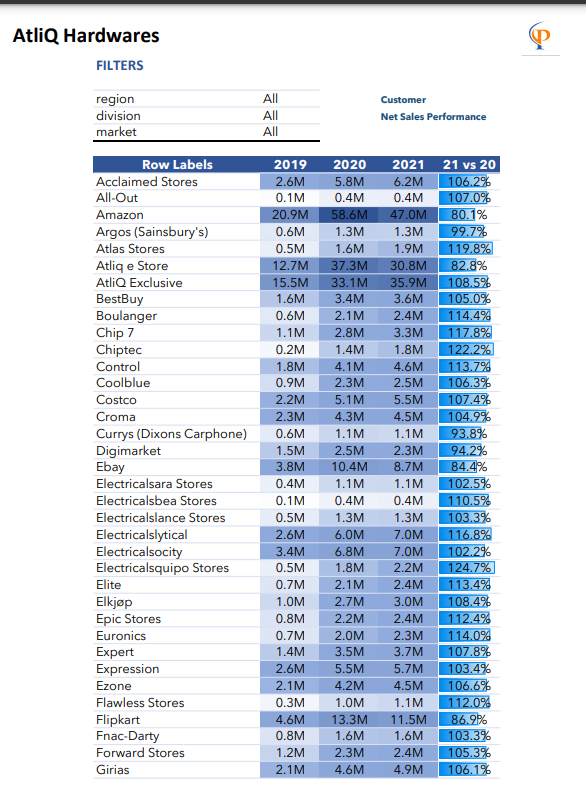

# AtliQ Hardwares Sales Report

This repository contains the sales performance data for AtliQ Hardwares from 2019 to 2021. The key metrics include total sales and year-over-year growth percentages for each customer.

## Summary

The sales report highlights the overall sales performance and identifies top-performing customers. Below is a summary of the key metrics and top customers.

### Key Metrics

- **Total Sales (2019):** $147.1M
- **Total Sales (2020):** $352.2M
- **Total Sales (2021):** $347.1M
- **Overall Growth (2020 vs 2019):** 139.4%
- **Overall Growth (2021 vs 2020):** -1.4%

### Top Performing Customers (2021)

1. **Atlas Stores**
   - **Sales (2021):** $1.9M
   - **Growth (2021 vs 2020):** 119.8%
2. **Chiptec**
   - **Sales (2021):** $1.8M
   - **Growth (2021 vs 2020):** 122.2%
3. **Electricalsquipo Stores**
   - **Sales (2021):** $2.2M
   - **Growth (2021 vs 2020):** 124.7%
4. **Integration Stores**
   - **Sales (2021):** $0.9M
   - **Growth (2021 vs 2020):** 133.0%
5. **Lotus**
   - **Sales (2021):** $4.9M
   - **Growth (2021 vs 2020):** 118.1%

## Full Report

The full sales report can be found in the `Customer_Sales.pdf` file in this repository.

